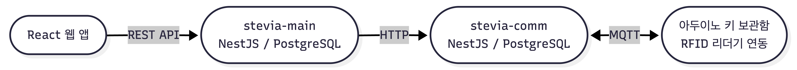

# RFID 기반 강의실 키 관리 애플리케이션

앱으로 강의실 키 대여·반납을 신청하면, 아두이노로 제작된 보관함이 자동으로 동작하는 무인 관리 시스템

**개발 기간:** 2024.03 ~ 2024.11

**팀 구성:** Frontend 2명 · Backend 3명 · PM 1명

**담당:** Backend (stevia-main 서버 개발)

---

## 개발 배경

기존에는 수기 명부로 강의실 키를 대여·반납 관리하여 담당자 상주가 필요하고 분실 추적이 어려웠습니다.

이를 해결하고자 RFID와 아두이노를 연동한 무인 보관함 시스템을 개발하였습니다.

---

## 시스템 아키텍처

- **stevia-main**: 인증, 예약, 키 대여·반납 비즈니스 로직 담당 (담당 서버)
- **stevia-comm**: MQTT로 아두이노와 실시간 통신, 키·도어 상태 관리
- **stevia-uiux**: React 기반 사용자 인터페이스

---

## 주요 기능

- 학번/비밀번호 기반 로그인 및 JWT 토큰 인증
- 강의실별 타임테이블 조회 및 시간대 예약 (최대 3시간 연속, 09:00~18:00)
- 예약 후 앱에서 키 대여·반납 요청 → 아두이노 보관함 자동 개폐
- 건물별 강의실 예약률 대시보드

---

## 기술 스택

| 구분 | 기술 |
|------|------|
| Backend | NestJS, PostgreSQL, Prisma ORM |
| Frontend | React 18, Vite, Redux Toolkit |
| IoT 통신 | MQTT (EMQX 브로커), Arduino |
| 인증 | JWT (Access/Refresh Token) |
| 배포 | PM2 |

---

## 담당 역할 (stevia-main)

**인증 시스템 설계**
- JWT 액세스 토큰(30분)·리프레시 토큰(1시간) 발급 및 갱신 구현
- `BearerTokenGuard`를 기반으로 `AccessTokenGuard` · `RefreshTokenGuard`를 확장하는 커스텀 가드 계층 설계

**예약 API 개발**
- 강의실 타임테이블 조회 및 예약 생성 API 구현
- `UsageTimePipe`로 입력값 유효성 검증 (허용 시간대·최대 연속 시간 제한)
- 건물별 예약률(예약 슬롯 수 / 전체 운영 시간) 계산 로직 구현

**키 대여·반납 연동**
- 대여·반납 요청 시 stevia-comm 서버에 HTTP 요청을 전달하여 아두이노 보관함 제어
- 반납 완료 후 DB 예약 레코드 삭제 처리

**공통**
- Prisma ORM 스키마 설계 및 Repository 패턴 적용
- 글로벌 ValidationPipe 설정 (DTO whitelist, 타입 자동 변환)